# Mermaidについて

- **Mermaidってココがすごい → 色んなグラフがサクッと描ける**
- **地味に バージョン管理が便利**
- **そして何よりも 文字で図が描けてMarkdownと相性◎**

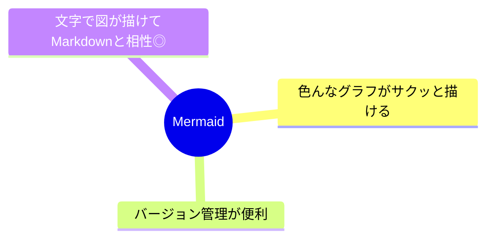

## Index -目次

<!-- TOC -->

- [Mermaidについて](#mermaidについて)
  - [Index -目次](#index--目次)
  - [Overview -概要](#overview--概要)
    - [Purpose -目的](#purpose--目的)
    - [Context -文脈](#context--文脈)
    - [Scope -範囲](#scope--範囲)
  - [Contents -内容](#contents--内容)
    - [（そもそも）ダイヤグラム・チャートについて](#そもそもダイヤグラムチャートについて)
      - [For what?](#for-what)
      - [Where?](#where)
    - [Mermaidの主要な図の種類と特徴](#mermaidの主要な図の種類と特徴)
      - [プロセス可視化系](#プロセス可視化系)
        - [フローチャート（Flowchart）](#フローチャートflowchart)
        - [シーケンス図（Sequence Diagram）](#シーケンス図sequence-diagram)
        - [状態遷移図（State Diagram）](#状態遷移図state-diagram)
      - [構造化系](#構造化系)
        - [クラス図（Class Diagram）](#クラス図class-diagram)
        - [ER図（ER Diagram）](#er図er-diagram)
        - [C4ダイアグラム（C4 Diagram）](#c4ダイアグラムc4-diagram)
      - [プロジェクト管理系](#プロジェクト管理系)
        - [カンバン（Kanban）](#カンバンkanban)
        - [ガントチャート（Gantt Chart）](#ガントチャートgantt-chart)
        - [タイムライン（Timeline）](#タイムラインtimeline)
        - [Gitグラフ（Git Graph）](#gitグラフgit-graph)
      - [分析・企画系](#分析企画系)
        - [ジャーニー図（Journey）](#ジャーニー図journey)
        - [象限チャート（Quadrant Chart）](#象限チャートquadrant-chart)
        - [マインドマップ（Mind Map）](#マインドマップmind-map)
      - [データ表現系](#データ表現系)
        - [パイチャート（Pie Chart）](#パイチャートpie-chart)
        - [XYチャート（XY Chart）](#xyチャートxy-chart)
      - [要件管理系](#要件管理系)
        - [要件図（Requirement Diagram）](#要件図requirement-diagram)
    - [Slidev（プレゼンテーション）での活用](#slidevプレゼンテーションでの活用)
  - [References and Notes -参考文献と注意事項](#references-and-notes--参考文献と注意事項)

<!-- /TOC -->

## Overview -概要

- Key Points -要点: ..
- Background -背景:
  - 文書作成していると図示したい場面があるがdraw.ioなどで書いた画像ってどうなの？
  - せっかくMarkdownで書いているので図も文字で描けないか・・・あった<-起点

### Purpose -目的

- Primary Goal -主な目標: できるだけMarkdown＋Mermaidで済ます
- Expected Benefits -期待される効果: そこそこ読みやすい文書作成の効率化
- Success Criteria -成功基準: 文書作成->Outputが継続する

### Context -文脈

- When to Use -いつ使うか: Markdown内に図示したい時
- Where to Apply -適用場所: Markdownで描けるとこ
- Prerequisites -前提条件: VSCodeとMermaid拡張機能 bierner.markdown-mermaid

### Scope -範囲

- Core Elements -コア要素: Markdown、Mermaid
- Related Topics -関連トピック: ..
- Limitations -制限事項: ..

## Contents -内容

### （そもそも）ダイヤグラム・チャートについて

#### For what?

1. ダイアグラムやチャートの主な目的:

   - 複雑な情報の単純化と理解促進
   - 複雑なシステムや概念を視覚的に表現することで、文章だけでは伝わりにくい情報を分かりやすく伝えることができます
   - 人間の脳は視覚情報を文字情報よりも素早く処理できるため、理解のスピードが向上します

2. コミュニケーションの効率化:

    - 異なる背景や専門知識を持つ人々の間でも、共通の理解を得やすくなります
    - 言語の壁を超えて情報を伝えることができます
    - 議論のポイントを明確にし、建設的な対話を促進します

3. パターンや関係性の発見:

    - データや情報の中に潜む傾向やパターンを視覚的に浮かび上がらせることができます
    - 要素間の関係性や構造を一目で把握することが可能になります

4. 意思決定の支援:

   - 複数の選択肢を比較検討する際の判断材料として活用できます
   - 問題点や改善点を特定しやすくなります

5. 記憶の定着とアイデア創出:

   - 視覚的な情報は記憶に残りやすく、長期的な理解を助けます
   - 新しいアイデアや解決策を生み出すきっかけになることがあります

#### Where?

- ダイアグラムは、それぞれの特性を活かして使い分けることで、より効果的なコミュニケーションと意思決定を支援します。
- 状況や目的に応じて適切なダイアグラムを選択することで、情報の伝達効率を最大化することができます。

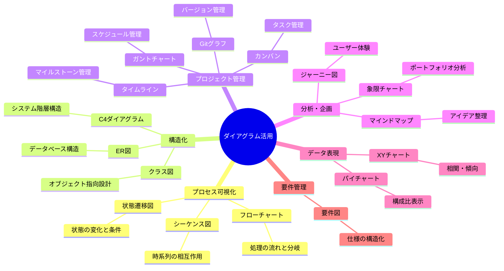

### Mermaidの主要な図の種類と特徴

#### プロセス可視化系

##### フローチャート（Flowchart）

- 処理の流れを表現
- TD（上下）、LR（左右）などの方向指定が可能

````.
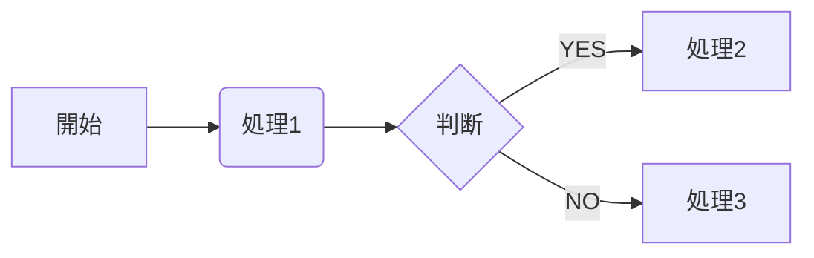
````


- **本質的効果**:
  - 複雑な処理の流れを直感的に理解できる
  - 条件分岐や繰り返しを明確に表現
- **活用シーン**:
  - ビジネスプロセスの設計・改善
  - アルゴリズムの説明
  - 業務マニュアルの作成

##### シーケンス図（Sequence Diagram）

- 時系列での相互作用を表現
- メッセージのやり取りを矢印で表現

````.
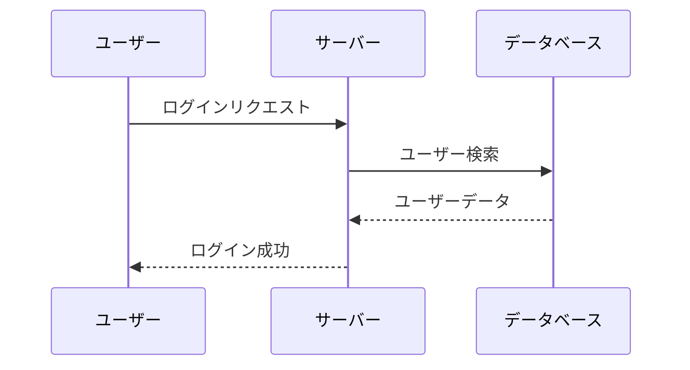
````


- **本質的効果**:
  - 複数の関係者・システム間の相互作用を時系列で把握
  - メッセージの流れと応答関係を明確化
- **活用シーン**:
  - システム間連携の設計
  - API設計のレビュー
  - ユースケースの詳細化

##### 状態遷移図（State Diagram）

- システムの状態変化を表現
- 状態間の遷移条件を記述可能

````.
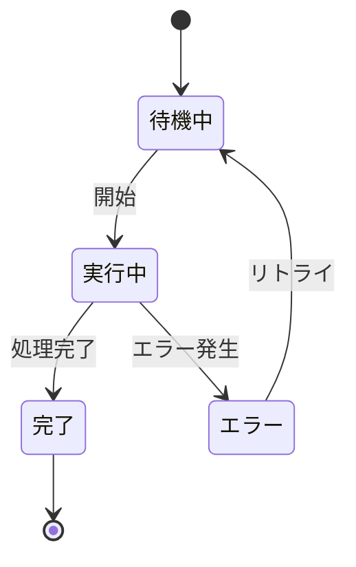
````


- **本質的効果**:
  - システムや物事の状態変化を追跡可能
  - 各状態間の遷移条件を明示
- **活用シーン**:
  - ワークフローの設計
  - エラー処理の設計
  - ステータス管理の可視化

#### 構造化系

##### クラス図（Class Diagram）

- クラスの構造と関係を表現
- メソッドや属性を定義可能

````.
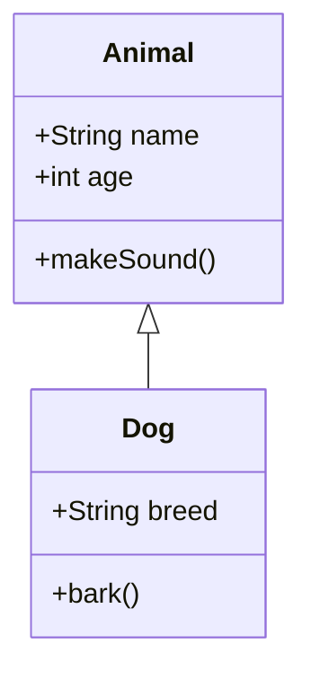
````


- **本質的効果**:
  - オブジェクト指向設計の構造を可視化
  - クラス間の関係性を明確化
- **活用シーン**:
  - ソフトウェア設計
  - コードのリファクタリング計画
  - システムの全体像把握

##### ER図（ER Diagram）

- データベースの構造を表現
- エンティティ間の関係を定義

````.
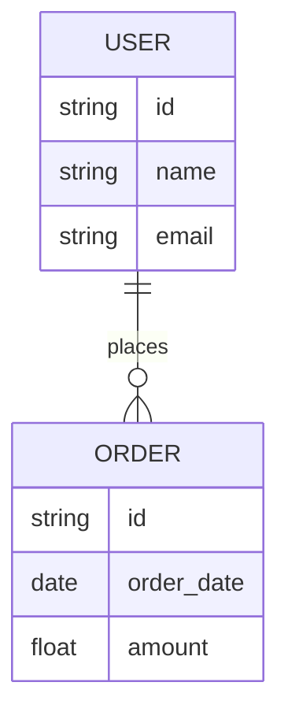
````


- **本質的効果**:
  - データベースの論理構造を可視化
  - テーブル間の関係性を明確化
- **活用シーン**:
  - データベース設計
  - データモデルの検討
  - システム間のデータ連携設計

##### C4ダイアグラム（C4 Diagram）

- システムアーキテクチャを異なる抽象レベルで表現
- コンテキスト、コンテナ、コンポーネント、コードの4つのレベル
- システム設計の詳細を階層的に可視化

````.
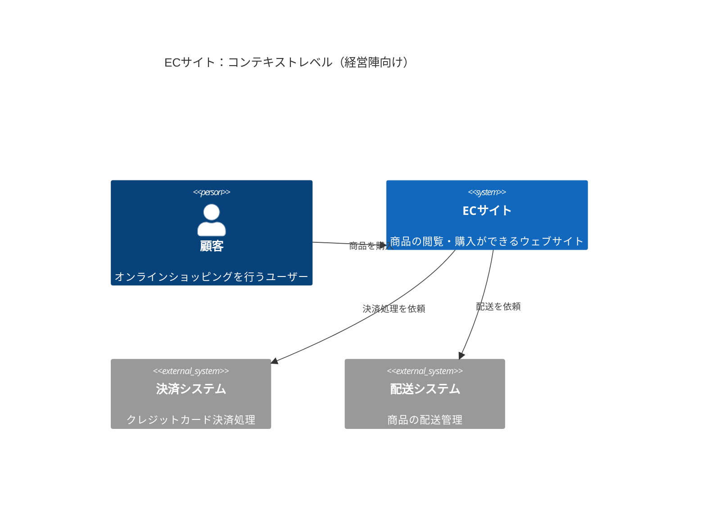
````


- **本質的効果**:
  - システムアーキテクチャを異なる粒度で表現
  - 階層的な構造を段階的に理解
- **活用シーン**:
  - システムアーキテクチャの設計
  - マイクロサービスの設計
  - ステークホルダーとの合意形成

#### プロジェクト管理系

##### カンバン（Kanban）

- タスクの進行状況や作業工程を視覚化
- チケット管理システムとの連携が可能
- メタデータによる詳細情報の付加が可能

````.
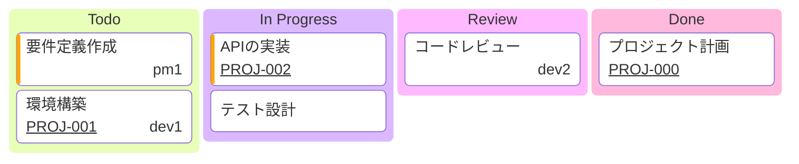
````


- **本質的効果**:
  - タスクの進行状況をリアルタイムで可視化
  - 担当者、優先度、チケット番号などの情報を統合
  - ワークフローの各段階での作業状況を明確化
- **活用シーン**:
  - アジャイル開発のタスク管理
  - チーム内の作業分担の可視化
  - プロジェクト進捗の追跡
  - チケット管理システムとの連携

##### ガントチャート（Gantt Chart）

- プロジェクトスケジュールを表現
- タスクの期間と依存関係を表示

````.
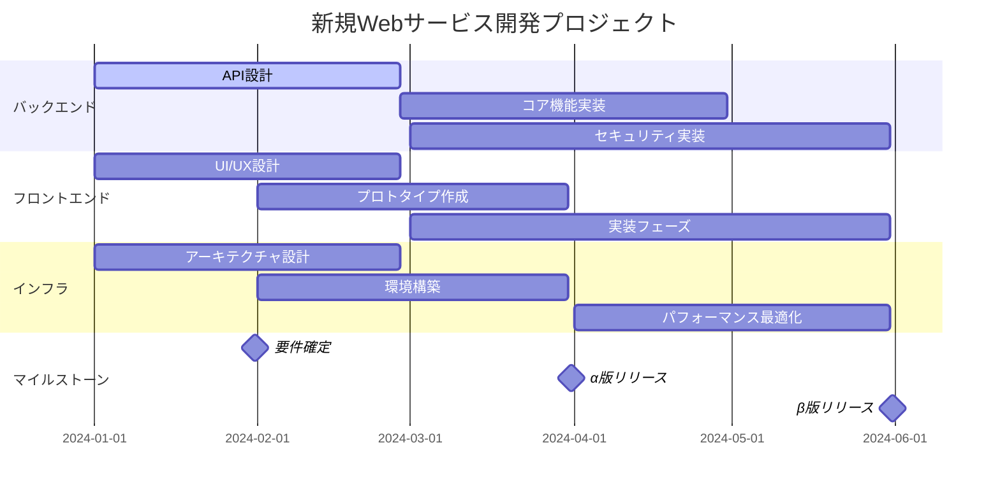
````


- **本質的効果**:
  - タスクの期間と依存関係を時系列で表示
  - プロジェクトの進捗状況を可視化
- **活用シーン**:
  - プロジェクトスケジュール管理
  - リソース配分の計画
  - マイルストーン管理

##### タイムライン（Timeline）

- 時系列での出来事や進展を表現
- 歴史的な流れや重要なイベントを可視化
- 期間や重要度を視覚的に表現可能

````.
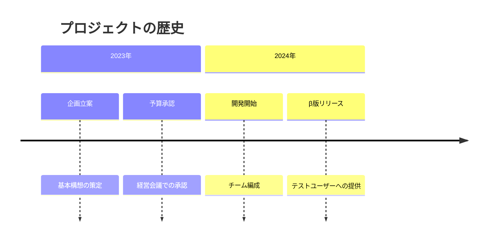
````

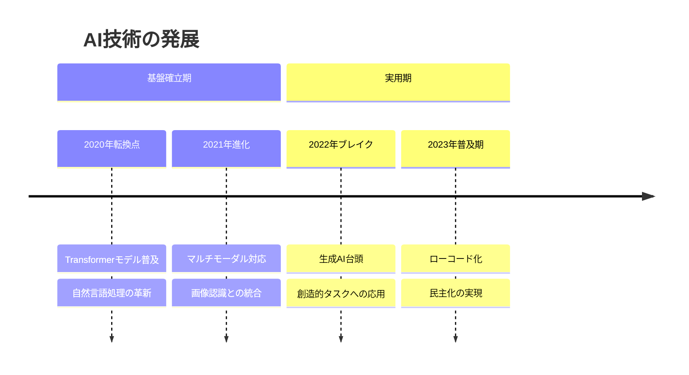

- **本質的効果**:
  - 重要なイベントを時系列で整理
  - プロジェクトの歴史や計画を可視化
  - 重要な転換点とその影響、各時期の代表的な成果、発展の文脈や背景を表現
- **活用シーン**:
  - プロジェクトの履歴管理
  - ロードマップの作成
  - マイルストーンの共有

##### Gitグラフ（Git Graph）

- Gitのブランチとコミット履歴を視覚化
- マージやチェリーピックなどの操作を表現
- ブランチ戦略の説明に最適

````.
```mermaid
gitGraph
    commit
    branch develop
    checkout develop
    commit
    commit
    checkout main
    merge develop
    commit
    branch feature
    checkout feature
    commit
    checkout develop
    merge feature
    checkout main
    merge develop
```
````

```mermaid
gitGraph
    commit
    branch develop
    checkout develop
    commit
    commit
    checkout main
    merge develop
    commit
    branch feature
    checkout feature
    commit
    checkout develop
    merge feature
    checkout main
    merge develop
```

- **本質的効果**:
  - バージョン管理の履歴を視覚化
  - ブランチ戦略の説明を容易に
- **活用シーン**:
  - 開発フローの説明
  - マージ戦略の検討
  - コードレビューの支援

#### 分析・企画系

##### ジャーニー図（Journey）

- ユーザー体験や進行状況を表現
- 各ステップの満足度を表示可能

````.
```mermaid
journey
    title 商品購入プロセス
    section 検索
      商品を探す: 5: ユーザー
      商品を比較: 3: ユーザー
    section 購入
      カートに追加: 4: ユーザー
      支払い: 3: ユーザー, システム
```
````

```mermaid
journey
    title 商品購入プロセス
    section 検索
      商品を探す: 5: ユーザー
      商品を比較: 3: ユーザー
    section 購入
      カートに追加: 4: ユーザー
      支払い: 3: ユーザー, システム
```

- **本質的効果**:
  - ユーザー体験を時系列で表現
  - 各段階での満足度を可視化
- **活用シーン**:
  - UX/UIデザイン
  - カスタマージャーニー分析
  - サービス改善検討

##### 象限チャート（Quadrant Chart）

- 2つの軸で区切られた4つの象限にアイテムを配置
- 市場分析やポートフォリオ管理などに活用
- 各象限の意味や項目の位置づけを視覚的に表現

````.
```mermaid
quadrantChart
    title 製品ポートフォリオ分析
    x-axis "低コスト" --> "高コスト"
    y-axis "低価値" --> "高価値"
    quadrant-1 "将来性期待"
    quadrant-2 "主力製品"
    quadrant-3 "要改善"
    quadrant-4 "検討必要"
    "製品A": [0.7, 0.8]
    "製品B": [0.3, 0.6]
    "製品C": [0.4, 0.2]
```
````

```mermaid
quadrantChart
    title 製品ポートフォリオ分析
    x-axis "低コスト" --> "高コスト"
    y-axis "低価値" --> "高価値"
    quadrant-1 "将来性期待"
    quadrant-2 "主力製品"
    quadrant-3 "要改善"
    quadrant-4 "検討必要"
    "製品A": [0.7, 0.8]
    "製品B": [0.3, 0.6]
    "製品C": [0.4, 0.2]
```

- **本質的効果**:
  - 2軸での評価を視覚的に表現
  - 項目の相対的な位置づけを明確化
- **活用シーン**:
  - 製品ポートフォリオ分析
  - 優先順位付け
  - 戦略立案

##### マインドマップ（Mind Map）

- 階層的な思考や関係性を視覚化
- アイディアの整理やブレーンストーミングに最適
- シンプルな構文で複雑な構造を表現

````.
```mermaid
mindmap
    root((プロジェクト管理))
        スコープ
            要件定義
            制約条件
        スケジュール
            マイルストーン
            進捗管理
        リソース
            人員配置
            予算管理
```
````

```mermaid
mindmap
    root((プロジェクト管理))
        スコープ
            要件定義
            制約条件
        スケジュール
            マイルストーン
            進捗管理
        リソース
            人員配置
            予算管理
```

- **本質的効果**:
  - アイデアや概念を階層的に整理
  - 関連性を視覚的に表現
- **活用シーン**:
  - ブレインストーミング
  - プロジェクト範囲の定義
  - 知識の体系化

#### データ表現系

##### パイチャート（Pie Chart）

- 割合や構成比を表現
- シンプルな円グラフを作成

````.
```mermaid
pie
    title 売上構成比
    "製品A" : 40
    "製品B" : 30
    "製品C" : 20
    "その他" : 10
```
````

```mermaid
pie
    title 売上構成比
    "製品A" : 40
    "製品B" : 30
    "製品C" : 20
    "その他" : 10
```

- **本質的効果**:
  - 全体に対する部分の比率を視覚化
  - 構成比を直感的に理解
- **活用シーン**:
  - 売上構成分析
  - リソース配分の可視化
  - 市場シェアの表現

##### XYチャート（XY Chart）

- X軸とY軸を使用した数値データの可視化
- 折れ線グラフや散布図などの表現が可能
- ベータ版機能として提供

````.
```mermaid
xychart-beta
    title "月間売上推移"
    x-axis [jan, feb, mar, apr, may]
    y-axis "売上高（万円）" 0 --> 1000
    line [100, 200, 450, 300, 500]
    bar [150, 250, 400, 350, 450]
```
````

```mermaid
xychart-beta
    title "月間売上推移"
    x-axis [jan, feb, mar, apr, may]
    y-axis "売上高（万円）" 0 --> 1000
    line [100, 200, 450, 300, 500]
    bar [150, 250, 400, 350, 450]
```

- **本質的効果**:
  - 2変数間の関係性を視覚化
  - 時系列データの傾向を表現
- **活用シーン**:
  - データ分析
  - トレンド把握
  - 相関関係の検証

#### 要件管理系

##### 要件図（Requirement Diagram）

- システム要件を構造化して表現
- 要件間の依存関係を明示
- テスト要件との紐付けが可能

````.
```mermaid
requirementDiagram
    requirement availability_req {
    id: 1
    text: System should have 99.9% availability
    risk: high
    verifymethod: test
    }

    element test_entity {
    type: simulation
    }

    test_entity - satisfies -> availability_req
```
````

```mermaid
requirementDiagram
    requirement availability_req {
    id: 1
    text: System should have 99.9% availability
    risk: high
    verifymethod: test
    }

    element test_entity {
    type: simulation
    }

    test_entity - satisfies -> availability_req
```

- **本質的効果**:
  - システム要件を体系的に整理
  - 要件間の依存関係を明確化
  - 検証方法との紐付けを可視化
- **活用シーン**:
  - システム仕様の定義
  - 要件のトレーサビリティ管理
  - 品質保証計画の立案
  - コンプライアンス要件の管理

- 要件図は特に以下のような点で他の図表と異なる価値を提供します
- 特にシステム開発やプロジェクトマネジメントにおいて、要件の定義から検証までの一貫した管理を支援する重要なツールとして位置づけられます

1. **検証可能性の明示**:
   - 各要件に対する検証方法を明確に示せる
   - テスト計画との連携が容易

2. **要件の階層構造化**:
   - 上位要件から下位要件への分解を表現
   - 要件間の関係性を明確に示せる

3. **品質管理との連携**:
   - 各要件の重要度やリスクレベルを表現
   - 品質基準との適合性を管理

### Slidev（プレゼンテーション）での活用

- プレゼンテーションでの段階的な情報開示を操作できる
- Slidevでは、Mermaid図の要素を順次表示させることができる

## References and Notes -参考文献と注意事項

- Related Documents -関連文書:
- Notes -注意事項:
